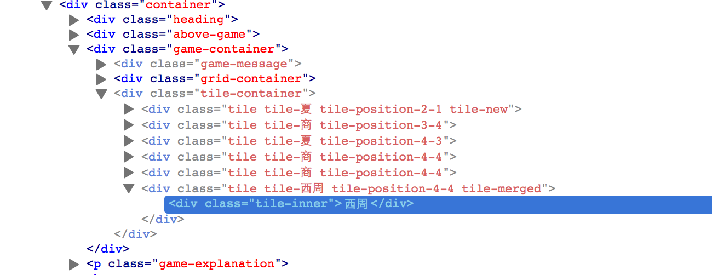

# 修改开源项目

<!-- toc -->

经过挑选，我决定拿最近比较火爆的开源游戏2048来练手，因为这个项目的规模不大，改起来应该不难。

## 改一个游戏来练手

众多的2048改编版，都非常类似，就是将数字的加法，变成某种等级序列的递进。比如：两个夏合在一起，变成商；两个商合在一起，变成西周。

确立了目标之后，我们需要找到在哪里修改代码，当然，前提是我们得把代码搞到本地来。

    首先访问：https://github.com/gabrielecirulli/2048 然后fork出一个自己的版本
    例如：https://github.com/zhuangbiaowei/2048
      
    然后，在自己的机器上，执行：
    git clone git@github.com:zhuangbiaowei/2048.git
  
随后，挑选自己喜欢的编辑器，打开2048的目录，开始查找可以下手的地方。

在js目录下的game_manager.js，我们发现了一个函数，叫做：addRandomTile。在这个函数里，有一行是这么写的：`var value = Math.random() < 0.9 ? 2 : 4;` 这种搞法，真的非常粗暴，随机加入一个方块，有90%的概率是2，有10%的概率是4。

所以，我也选择了比较粗暴的搞法，在这个js的第一行，加了一句：`NameArray = ['夏','商','西周','春秋','战国','秦','汉','三国','两晋','南北朝','隋','唐','五代十国','宋','元','明','清','民国','新中国'];` 然后把刚才的那句改成：`var value = Math.random() < 0.9 ? NameArray[0] : NameArray[1];`

这是唯一的修改，我们可以在浏览器里打开index.html，看看效果。

每次出来的方块，的确是朝代名称了，但是加在一起之后，却全都变成了2。

还是在game_manager.js，我们发现了如下一段代码：
```javascript
    var merged = new Tile(positions.next, tile.value * 2);
    merged.mergedFrom = [tile, next];
    
    self.grid.insertTile(merged);
    self.grid.removeTile(tile);
    
    // Converge the two tiles' positions
    tile.updatePosition(positions.next);
    
    // Update the score
    self.score += merged.value;
    
    // The mighty 2048 tile
    if (merged.value === 2048) self.won = true;
```    
看来这就是我们要修改的关键所在了。`tile.value`的值现在是一个字符串，所以不能简单的乘以2，我们可以先找到它在NameArray里的位置，然后取它的下一个值。
```javascript
    var pos =NameArray.indexOf(tile.value);
    var merged = new Tile(positions.next, NameArray[pos+1]);
```
另外，`merged.value`也不能直接加到`self.score`里去了，要改成:
```javascript
    now_value=Math.pow(2,pos+2);
    self.score += now_value;
    if (now_value === 2048) self.won = true;
```    
再运行一下看看，发现了一些丑陋的bug。


1. 颜色不对，不同的朝代应该有不同的颜色
2. 字体大小不对，两个字的朝代，有一个字就到下面去了

打开Firefox里的Firebug，我们可以查看到问题所在：


原版的2048，相当粗暴地直接将方块里的内容，当成css的class的内容。因为现在的方块里都变成了汉字，所以我们得将汉字转换成实际的数字。

在html_actuator.js中，我们找到了这样一句： `var classes = ["tile", "tile-" + tile.value, positionClass];`

我们可以在这一行的前面，补上两句：
```javascript
    var pos =NameArray.indexOf(tile.value);
    var tile_value=Math.pow(2,pos+1);
    //再修改一下刚才的那句：
    var classes = ["tile", "tile-" + tile_value, positionClass];
```    
于是，正常的颜色就会出现了。至于字体大小的问题，我们得回到main.css中去找答案。
```javascript
    .tile .tile-inner {
      border-radius: 3px;
      background: #eee4da;
      text-align: center;
      font-weight: bold;
      z-index: 10;
      font-size: 55px; }
```
我们可以简单粗暴将`font-size: 55px;`，改成`font-size: 35px;`。我们看一下现在的效果：


OK，打完收工!


## 二分查找捉虫记（作者：蒋鑫）

### 问题现象

Git 2.8.0 版本即将发布，今天把工作站的 Git 版本升级到 `2.8.0-rc0`，结果悲剧了。所有使用 HTTP 协议的 Git 仓库都无法正常访问！

在确认不是网络和内部的 Git 服务器问题之后，自然怀疑到了 HTTP 代理。果然清空了 `http_proxy` 环境变量后，Git 命令工作正常了：

    http_proxy= git ls-remote http://internal-git-server/git/repo.git

可是在我升级之前 Git 工作是正常的啊！又尝试下面命令，即设置一个错误的 http 代理，同时通过 `no_proxy=*` 来绕过代理，
看看 Git 命令能否正确执行：

    $ http_proxy=bad_proxy no_proxy=* git ls-remote http://internal-git-server/git/repo.git
    fatal: unable to access 'http://internal-git-server/git/repo.git/': Couldn't resolve proxy 'bad_proxy'

显然新版本的 Git 没有去检查 `no_proxy` 环境变量设置。这个 Bug 是如何产生的呢？

### 二分查找

将版本切换到 `v2.7.0`，编译安装 Git。（注意一定要安装，而不是执行当前目录下的 Git。这是因为该命令执行过程中会依次调用 `git-ls-remote`
和 `git-remote-http` 命令，而这两个命令是位于安装路径中的。）

    $ git checkout v2.7.0
    $ make -j8 && make install # 我的工作站是四核CPU，故此使用 -j8 两倍并发执行编译

测试发现 Git 2.7.0 能够通过 `no_proxy` 变量,绕过错误的 `http_proxy` 环境变量：

    $ http_proxy=bad_proxy no_proxy=* git ls-remote http://internal-git-server/git/repo.git
    206b4906c197e76fcc63d7a453f9e3aa00dfb3da        HEAD
    206b4906c197e76fcc63d7a453f9e3aa00dfb3da        refs/heads/master

那么一定是 `v2.7.0` 和 `v2.8.0-rc0` 中间的某个版本引入的 Bug！

想必大家都玩过猜数字游戏吧：一个人在1到100的数字中随意选择一个，另外一个人来猜，小孩子总是一个挨着一个地猜，
懂得折半查找的大人总是获胜者。Git 提供的 git bisect 这一命令，就是采用这样的二分查找快速地在提交中定位 Bug，
少则几次，多则十几次就会定位到引入Bug的提交。

1. 首先执行下面命令启用二分查找。

        $ git bisect start

2. 标记一个好版本。下面的命令使用 tag（v2.7.0）来标记 Git 2.7.0 版本是好版本，换做40位的提交号也行。

        $ git bisect good v2.7.0

3. 标记 Git 2.8.0-rc0 是一个坏版本。注意：马上就是见证奇迹的时刻。

        $ git bisect bad v2.8.0-rc0
        Bisecting: 297 revisions left to test after this (roughly 8 steps)
        [563e38491eaee6e02643a22c9503d4f774d6c5be] Fifth batch for 2.8 cycle

   看到了么？当完成对一个好版本和一个坏版本的标记后，Git 切换到一个中间版本（`563e384`），并告诉我们大概需要8步可以找到元凶。

4. 在这个版本下执行前面的测试操作：

        $ make -j8 && make install
        $ git --version
        git version 2.7.0.297.g563e384
        $ http_proxy=bad_proxy no_proxy=* git ls-remote http://internal-git-server/git/repo.git
        fatal: unable to access 'http://internal-git-server/git/repo.git/': Couldn't resolve proxy 'bad_proxy'

5. 对这个版本进行标记。

   这是一个坏版本：

        $ git bisect bad
        Bisecting: 126 revisions left to test after this (roughly 7 steps)
        [e572fef9d459497de2bd719747d5625a27c9b41d] Merge branch 'ep/shell-command-substitution-style'

我们可以机械地重复上面4、5的步骤，直到最终定位。但是人工操作很容易出错。如果对版本标记错了，把 good 写成了 bad 或者相反，
就要执行 `git bisect reset` 重来。（小窍门：git bisect log 可以显示 git bisect 标记操作日志）

于是决定剩下的二分查找使用脚本来完成。

### 自动化的二分查找

Git 二分查找允许提供一个测试脚本，Git 会根据这个测试脚本的返回值，决定如何来标记提交：

* 返回值为 0：这个提交是一个好提交。
* 返回值为 125：这个提交无法测试（例如编译不过去），忽略这个提交。
* 返回值为 1-127（125除外）：这个提交是一个坏提交。
* 其他返回值：二分查找出错，终止二分查找操作。

那么就我们先来看看 `git ls-remote` 的返回值：

* 正确执行的返回值是 0:

        $ http_proxy= git ls-remote http://internal-git-server/git/repo.git
        206b4906c197e76fcc63d7a453f9e3aa00dfb3da        HEAD
        206b4906c197e76fcc63d7a453f9e3aa00dfb3da        refs/heads/master
        $ echo $?
        0

* 错误执行的返回值是 128！

        $ http_proxy=bad_proxy git ls-remote http://internal-git-server/git/repo.git
        fatal: unable to access 'http://internal-git-server/git/repo.git/': Couldn't resolve proxy 'bad_proxy'
        $ echo $?
        128


于是创建一个测试脚本 `git-proxy-bug-test.sh`，内容如下：

    #!/bin/sh

    make -j8 && make install && \
    git --version && \
    http_proxy=bad_proxy no_proxy=* \
    git ls-remote http://internal-git-server/git/repo.git

    case $? in
    0)
        exit 0
        ;;
    128)
        exit 1
        ;;
    *)
        exit 128
        ;;
    esac

然后敲下如下命令，开始自动执行二分查找：

    $ git bisect run sh git-proxy-bug-test.sh

自动化查找过程可能需要几分钟，站起来走走，休息一下眼睛。再回到座位，最终的定位结果就展现在了眼前：

    372370f1675c2b935fb703665358dd5567641107 is the first bad commit
    commit 372370f1675c2b935fb703665358dd5567641107
    Author: Knut Franke <k.franke@science-computing.de>
    Date:   Tue Jan 26 13:02:48 2016 +0000

        http: use credential API to handle proxy authentication

        Currently, the only way to pass proxy credentials to curl is by including them
        in the proxy URL. Usually, this means they will end up on disk unencrypted, one
        way or another (by inclusion in ~/.gitconfig, shell profile or history). Since
        proxy authentication often uses a domain user, credentials can be security
        sensitive; therefore, a safer way of passing credentials is desirable.

        If the configured proxy contains a username but not a password, query the
        credential API for one. Also, make sure we approve/reject proxy credentials
        properly.

        For consistency reasons, add parsing of http_proxy/https_proxy/all_proxy
        environment variables, which would otherwise be evaluated as a fallback by curl.
        Without this, we would have different semantics for git configuration and
        environment variables.

        Helped-by: Junio C Hamano <gitster@pobox.com>
        Helped-by: Eric Sunshine <sunshine@sunshineco.com>
        Helped-by: Elia Pinto <gitter.spiros@gmail.com>
        Signed-off-by: Knut Franke <k.franke@science-computing.de>
        Signed-off-by: Elia Pinto <gitter.spiros@gmail.com>
        Signed-off-by: Junio C Hamano <gitster@pobox.com>

    :040000 040000 de69688dd93e4466c11726157bd2f93e47e67330 d19d021e8d1c2a296b521414112be0966bd9f09a M      Documentation
    :100644 100644 f46bfc43f9e5e8073563be853744262a1bb4c5d6 dfc53c1e2554e76126459d6cb1f098facac28593 M      http.c
    :100644 100644 4f97b60b5c8abdf5ab0610382a6d6fa289df2605 f83cfa686823728587b2a803c3e84a8cd4669220 M      http.h
    二分查找运行成功

### 解决问题

既然我们知道引入 Bug 的提交，让我们看看这个提交：


    $ git show --oneline --stat 372370f1675c2b935fb703665358dd5567641107
    372370f http: use credential API to handle proxy authentication
     Documentation/config.txt | 10 +++++--
     http.c                   | 77 ++++++++++++++++++++++++++++++++++++++++++++++++
     http.h                   |  1 +
     3 files changed, 85 insertions(+), 3 deletions(-)


相比很多人动辄提交改动了几百、几千行的代码，这个提交的改动算得上简短了。小提交的好处就是易于阅读、易于问题定位、易于回退。

最终参照上面定位到的问题提交，我的 Bugfix  如下（为了下面的一节叙述方便，给代码补丁增加了行号）：

    01  diff --git a/http.c b/http.c
    02  index 1d5e3bb..69da445 100644
    03  --- a/http.c
    04  +++ b/http.c
    05  @@ -70,6 +70,7 @@ static long curl_low_speed_limit = -1;
    06   static long curl_low_speed_time = -1;
    07   static int curl_ftp_no_epsv;
    08   static const char *curl_http_proxy;
    09  +static const char *curl_no_proxy;
    10   static const char *http_proxy_authmethod;
    12   static struct {
    13   	const char *name;
    13  @@ -624,6 +625,11 @@ static CURL *get_curl_handle(void)
    15   		}
    16
    17   		curl_easy_setopt(result, CURLOPT_PROXY, proxy_auth.host);
    18  +#if LIBCURL_VERSION_NUM >= 0x071304
    19  +		var_override(&curl_no_proxy, getenv("NO_PROXY"));
    20  +		var_override(&curl_no_proxy, getenv("no_proxy"));
    21  +		curl_easy_setopt(result, CURLOPT_NOPROXY, curl_no_proxy);
    22  +#endif
    23   	}
    24   	init_curl_proxy_auth(result);
    25
    26  --
    27  2.8.0.rc0

### 写提交说明

这个提交是要贡献给 Git 上游的，评审者可能会问我如下问题：

1. Bug 的现象是什么？

   “系统的 no_proxy 变量不起作用，git 可能无法访问 http 协议的仓库。”

2. 从什么版本引入这个 Bug？

   “我们定位到的这个提交引入的 Bug。之所以会引入这个 Bug，是因为这个提交读取了 `http_proxy` 等环境变量，
   自动通过 `git-credential` 获取的信息补齐 `http_proxy` 的缺失的代理认证口令，并显示设置 libcurl 的参数。”

3. 之前的版本为什么没有出现这个问题？什么条件下会出现？

   “之前的版本也会出现问题，但是只有在用户主动设置了 `http.proxy` 配置变量才会出现。
   用户很少会去设置 `http.proxy` 配置变量，而通常是使用 `http_proxy` 环境变量。”

4. 你是如何解决的？你的解决方案是否最佳？

   “读取 `no_proxy` 环境变量，并为 `libcurl` 配置相应参数。因为 `libcurl` 只在 `7.19.4` 之后才引入 `CURLOPT_NOPROXY`，因此需要添加条件编译。”

实际上，前面的 Bugfix 原本是没有那个条件编译的。即补丁的第18行、22行一开始是没有的，
在回答第4个问题的时候，我仔细查看了 [libcurl API](https://curl.haxx.se/libcurl/c/CURLOPT_NOPROXY.html)，
发现只有在 `7.19.4` 版本之后，才支持 `CURLOPT_NOPROXY` 参数，因此如果不添加这个编译条件，
在特定的平台可能会导致 Git 无法编译通过。

下面就是最终的提交说明：

    http: honor no_http env variable to bypass proxy

    Curl and its families honor several proxy related environment variables:

    * http_proxy and https_proxy define proxy for http/https connections.
    * no_proxy (a comma separated hosts) defines hosts bypass the proxy.

    This command will bypass the bad-proxy and connect to the host directly:

        no_proxy=* https_proxy=http://bad-proxy/ \
        curl -sk https://google.com/

    Before commit 372370f (http: use credential API to handle proxy auth...),
    Environment variable "no_proxy" will take effect if the config variable
    "http.proxy" is not set.  So the following comamnd won't fail if not
    behind a firewall.

        no_proxy=* https_proxy=http://bad-proxy/ \
        git ls-remote https://github.com/git/git

    But commit 372370f not only read git config variable "http.proxy", but
    also read "http_proxy" and "https_proxy" environment variables, and set
    the curl option using:

        curl_easy_setopt(result, CURLOPT_PROXY, proxy_auth.host);

    This caused "no_proxy" environment variable not working any more.

    Set extra curl option "CURLOPT_NOPROXY" will fix this.

    Signed-off-by: Jiang Xin <xin.jiang@huawei.com>

### 贡献给上游

Git 项目本身是通过邮件列表参与代码贡献的，基本的操作流程是将代码转换为补丁文件，然后邮件发送。
基本上就是两条命令：`git format-patch` 和 `git send-email`。

下面的链接就是 Git 社区关于我这个提交的讨论。Junio已经确认这个提交是 2.8.0 的一个 regression，相信会合入2.8.0的发布版。

* http://thread.gmane.org/gmane.comp.version-control.git/287843/focus=287888
