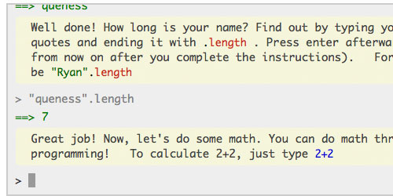
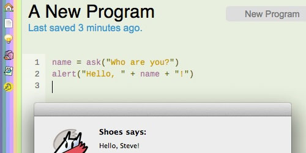
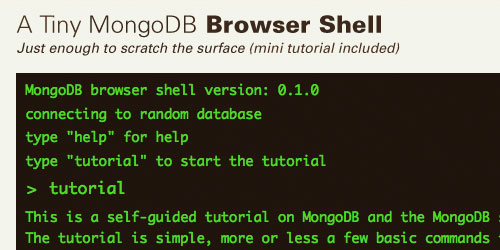

#  指导开发者快速学习编程的网站推荐

* 英文原文：[9 Useful Websites to Learn How to Code Quickly](http://www.queness.com/post/10709/8-useful-websites-to-learn-how-to-code-quickly)
* 翻译:  [wangguo](http://wangguo.iteye.com/)

互联网是一个飞速发展的领域，从HTML到HTML5、从CSS到CSS3、从JavaScript到JavaScript框架，技术在不断地更新换代。如果你不能跟上这个形势，你将会被淘汰。因此，快速掌握一门语言或一项技术，对于你的Web开发工作将是百利无一害的。 

本文为你带来了9个实用的在线教程，一些是互动形式的，还有一些则以全面的指南和可视化形式帮助你快速掌握一门语言。它们有共同的目的，让你的学习更加有乐趣，以及更容易让你掌握这些知识。 

##  [LifeHacker Learn to code](http://www.lifehacker.com.au/2011/02/learn-to-code-the-full-beginners-guide/)

语言：JavaScript 

4节课+最佳实践/资源，教你如何使用Javascript进行编程。每节课有一个视频和详细的文章，来确保你理解这些内容。 

##  [CodeCademy](http://www.codecademy.com/)

语言：JavaScript 

这是一个互动的教学形式，让你一点一点掌握JavaScript。每完成一个课程，你可以得到一些成就点和徽章，通过该形式来激发你的学习兴趣。 

## [TeamTreeHouse](http://teamtreehouse.com/)

语言：CSS、CSS3、HTML、HTML5、JavaScript、Basic编程和iOS开发 

这是一个付费会员在线学习服务，完全覆盖了Web设计和开发等主题，也包括目前非常流行的iOS开发。 

## [RubyMonk](http://rubymonk.com/)

语言：Ruby 

RubyMonk是一个互动的学习平台。你可以通过课程、问题解决或者相关文章来学习Ruby。 

## [Hackety](https://github.com/hacketyhack/hacketyhack)

语言：Ruby 

Hackety将会教你掌握绝对的编程基础知识，即使你没有任何编程经验。 

## [jQuery Air](http://jqueryair.com/)

语言：JavaScript 

jQuery是最著名的JavaScript框架。现在你可以直接在浏览器中学习jQuery。学习jQuery的过程应该是充满乐趣的，jQuery Air通过大量实践的方式来达到这个目的。 

## [CodingBat](http://codingbat.com/)

语言：Java、Python 

通过解决示例问题以及在线编码实践的形式，来学习Java和Python。 

## [PHP Know How](http://www.phpknowhow.com/)

语言：PHP

这并不是一个互动的学习方式，但它有一个很好的书面教程，包含了大量示例和指南，教你学习PHP和MySQL的基本知识。 

## [MongoDB](http://www.mongodb.org/)

语言：Java、Python、Go、PHP等主流开发语言

这是MongoDB的官方网站。MongoDB是由 C++ 语言编写的一个可扩展、高性能、开源的NoSQL数据库。适用于Java、Python、Go、PHP等主流开发语言。该网站中包含一个教程，让你通过一些命令来开始你的MongoDB学习旅程。 

## [学堂在线](https://next.xuetangx.com/)

技术：微信小程序开发，算法

这是清华大学等机构支撑的在线教育网站。其中包含推荐算法，微信小程序制作等课程。

## [keybr](https://www.keybr.com)

技术：高速打字

简介：工欲善其事，必先利其器！程序员的双手就是最重要的武器之一，因此练习正确的快速输入尤其重要。这个网站画风简洁，在云端保存了你的打字记录，记录你的成长和进步。

